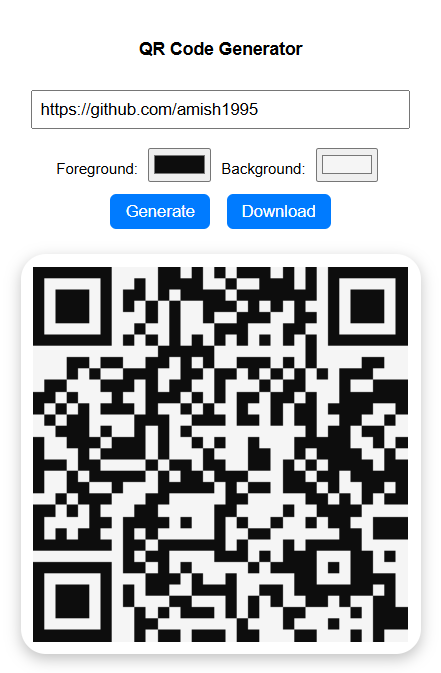

# Quick QR Generator

**Quick QR Generator** is a simple and lightweight Chrome extension that allows you to instantly generate QR codes from any link or text directly in your browser.

---

## 🎥 Demo

---

## 🚀 Features

- Generate QR codes instantly from URLs or text  
- Customize QR colors and design for a cleaner look  
- Option to **download QR codes** as PNG images  
- Works completely **offline** – no internet connection required  
- **No data collection** – your links/text never leave your device  
- Simple and fast user interface  

---

## 🔒 Privacy

This extension does **not collect, share, or store any personal data**.  
All QR code generation happens locally in your browser.

---

## 📥 Installation Guide (Developer Mode)

1. Clone or download this repository. The folder `qr-extension` contains all necessary files (`manifest.json`, `popup.html`, `popup.js`, `style.css`, and icon files).  
2. Open **Google Chrome** and go to:  
   `chrome://extensions/`  
3. In the top-right, enable **Developer mode**.  
4. Click **Load unpacked**.  
5. Select the `qr-extension` folder from the repository.  
6. The extension will now appear in your extensions list.

---

## 🛠️ How to Use

1. Click on the **Quick QR Generator** icon in your Chrome toolbar.  
2. Enter or paste the link/text you want to convert into a QR code.  
3. Customize the QR code color (optional).  
4. Click **Generate** to create your QR code.  
5. Click **Download QR** to save it as an image.  
6. Scan the QR code with any QR scanner app (Google Lens, phone camera, etc.).

---

## 📷 Screenshot

---

## 📌 Notes

- Works best with valid URLs like `https://www.google.com`  
- For local testing, ensure you have proper icon files (`icon16.png`, `icon48.png`, `icon128.png`)  
- Logo image inside the QR is optional – if not provided, a plain QR code will be generated  

---

### ✅ Ready to use and share your QR codes instantly!
